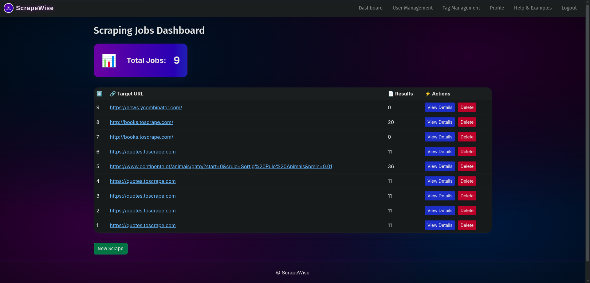
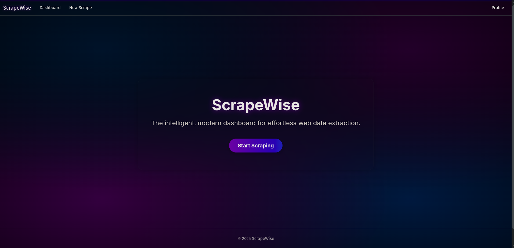
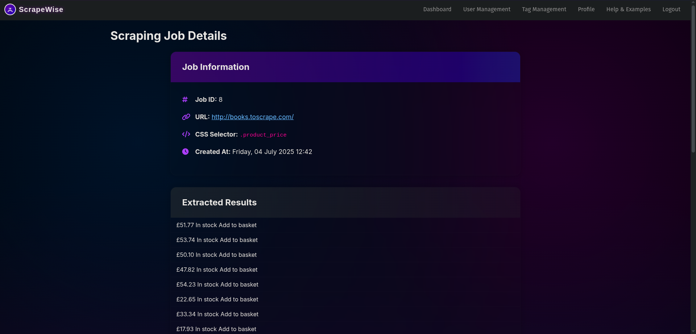
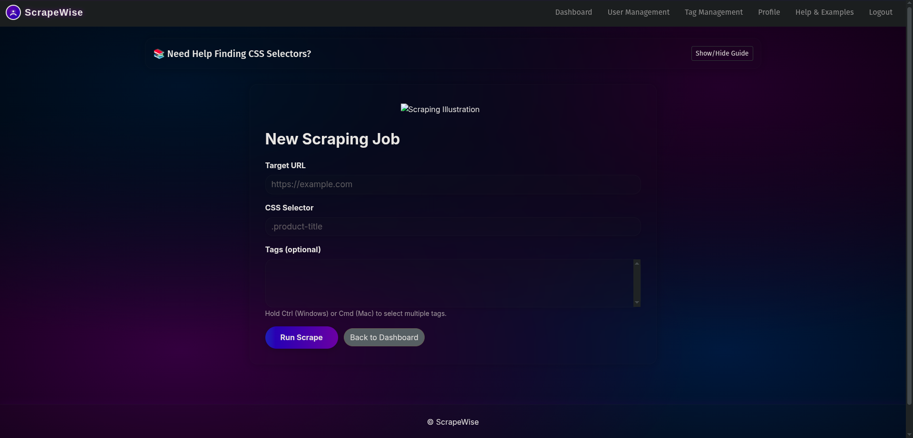
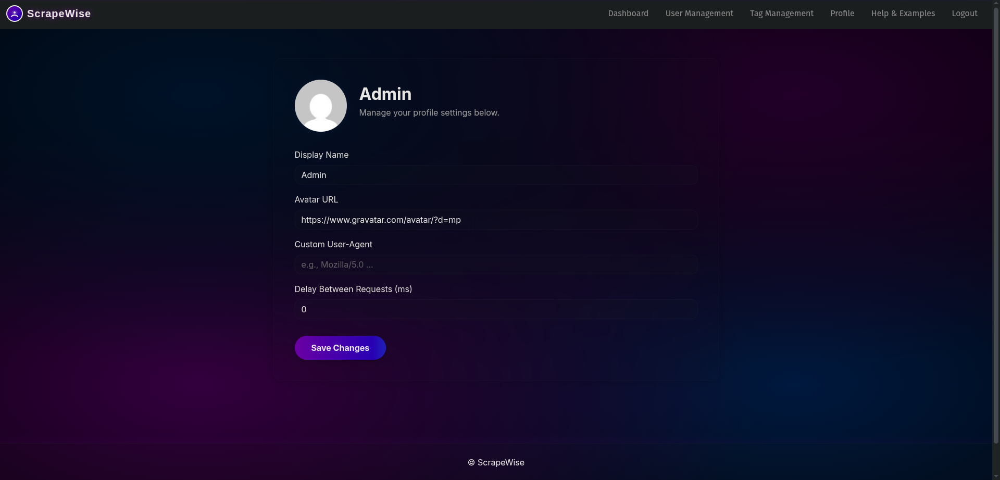

# ScrapeWise - Web Scraping Dashboard


[](https://github.com/dirshaye/ScrapeWise/actions/workflows/azure-deploy.yml)
[](https://opensource.org/licenses/MIT)
[](https://dotnet.microsoft.com/)
[](https://azure.microsoft.com/)

## Live Demo
**[Visit ScrapeWise Live Application](https://scrapewise-app-x2w3nky2.azurewebsites.net)**

## Overview

ScrapeWise is a modern web scraping platform built with Microsoft technologies and deployed to Azure. The application provides an intuitive dashboard for creating, managing, and monitoring web scraping operations with real-time updates and comprehensive analytics.

**Built with Microsoft Technology Stack:**
- **ASP.NET Core 9.0** with MVC architecture
- **Microsoft SQL Server** and Azure SQL Database
- **Azure App Service** for cloud hosting
- **Entity Framework Core** for data access
- **ASP.NET Core Identity** for authentication
- **SignalR** for real-time communication
- **Azure DevOps integration** via GitHub Actions

## Key Features

### Core Functionality
- **Smart Web Scraping**: Create and manage sophisticated scraping jobs with customizable parameters
- **Real-time Dashboard**: Monitor scraping jobs with live updates via SignalR
- **Job Management**: Schedule, pause, resume, and delete scraping operations
- **Data Export**: Export scraped data in multiple formats (JSON, CSV, XML)
- **Tag System**: Organize and categorize scraping jobs efficiently

### Security & Authentication
- **ASP.NET Core Identity**: Secure user authentication and authorization
- **Role-based Access**: Admin panel with user management capabilities
- **Data Protection**: Secure handling of sensitive scraping configurations

### Analytics & Monitoring
- **Performance Metrics**: Track success rates, response times, and error patterns
- **Job Statistics**: Comprehensive analytics on scraping operations
- **Real-time Notifications**: Instant updates on job status changes

### Technical Features
- **Containerized Deployment**: Docker support with Azure Container Registry
- **CI/CD Pipeline**: Automated deployment with rollback capabilities
- **Scalable Architecture**: Modular design following best practices
- **API Integration**: RESTful APIs for external integrations

## Technology Stack

### Backend & Microsoft Technologies
- **ASP.NET Core 9.0** - Modern web framework with MVC architecture
- **C# 12** - Latest language features and performance improvements
- **Microsoft SQL Server / Azure SQL Database** - Enterprise-grade database solution
- **Entity Framework Core** - Code-first ORM with migrations
- **ASP.NET Core Identity** - Comprehensive authentication and authorization
- **SignalR** - Real-time bidirectional communication

### Cloud & Infrastructure
- **Azure App Service** - Scalable cloud hosting platform
- **Azure Container Registry** - Docker container management
- **Azure SQL Database** - Managed database service
- **GitHub Actions** - Automated CI/CD pipeline

### Frontend & UI
- **Bootstrap 5** - Responsive UI framework with custom styling
- **JavaScript ES6+** - Modern client-side development
- **Chart.js** - Data visualization and analytics
- **Font Awesome** - Professional icon library

### Development & Deployment
- **Docker** - Containerization technology
- **GitHub Actions** - CI/CD automation
- **Azure DevOps integration** - Seamless deployment pipeline

### Development Tools
- **Infrastructure as Code**: Terraform
- **Version Control**: Git with GitHub
- **Package Management**: NuGet
- **Code Quality**: Built-in analyzers and best practices

## Quick Start

### Prerequisites
- .NET 9.0 SDK
- Docker (optional, for containerization)
- Azure SQL Database or SQL Server
- Git

### Local Development Setup

1. **Clone the repository**
   ```bash
   git clone https://github.com/dirshaye/ScrapeWise-Intelligent-Web-Scraping-Dashboard-ASP.NET-Core-MVC-.git
   cd ScrapeWise-Intelligent-Web-Scraping-Dashboard-ASP.NET-Core-MVC-
   ```

2. **Configure Database**
   ```bash
   # Create .env file (never commit this!)
   cp .env.example .env
   # Edit .env with your database connection string
   ```

3. **Install Dependencies**
   ```bash
   dotnet restore
   ```

4. **Run Database Migrations**
   ```bash
   dotnet ef database update --project src
   ```

5. **Start the Application**
   ```bash
   dotnet run --project src
   ```

6. **Access the Application**
   - Local URL: `https://localhost:7139`
   - Swagger API: `https://localhost:7139/swagger`

### Docker Setup

```bash
# Build and run with Docker
docker build -t scrapewise .
docker run -p 8080:80 -e ConnectionStrings__DefaultConnection="your_connection_string" scrapewise
```

## Project Structure

```
ScrapeWise/
├── src/                  # ASP.NET Core MVC Application
│   ├── Controllers/      # MVC Controllers
│   ├── Models/          # Data Models
│   ├── Views/           # Razor Views
│   ├── Data/            # Database Context
│   ├── Services/        # Business Logic
│   ├── Hubs/            # SignalR Hubs
│   ├── Extensions/      # Extension Methods
│   ├── wwwroot/         # Static Files
│   ├── Migrations/      # EF Migrations
│   ├── Areas/           # ASP.NET Areas
│   ├── Properties/      # Launch Settings
│   └── Program.cs       # Entry Point
├── .github/             # GitHub-specific files
│   ├── workflows/       # CI/CD workflows
│   └── images/          # README screenshots
├── terraform/           # Infrastructure as Code
├── Dockerfile           # Container Definition
├── .dockerignore        # Docker Ignore Rules
├── README.md            # Main Documentation
├── LICENSE              # License
├── CONTRIBUTING.md      # Contribution Guide
└── .env.example         # Environment Template
```

## Configuration

### Environment Variables

The application uses environment variables for configuration:

```bash
# Database
ConnectionStrings__DefaultConnection="Host=host;Database=db;Username=user;Password=pass"

# Environment
ASPNETCORE_ENVIRONMENT=Production
ASPNETCORE_URLS=http://+:80

# Optional: Additional services
AZURE_SIGNALR_CONNECTION_STRING="your_signalr_connection"
```

### Application Settings

Key configuration options in `appsettings.json`:

```json
{
  "Logging": {
    "LogLevel": {
      "Default": "Information"
    }
  },
  "AllowedHosts": "*"
}
```

## Deployment

### Azure Deployment (Recommended)

The application includes a complete CI/CD pipeline for Azure deployment:

1. **Automatic Deployment**: Push to main branch triggers deployment
2. **Health Checks**: Automatic verification of deployment success
3. **Rollback**: Automatic rollback on deployment failure
4. **Image Management**: Cleanup of old container images

For detailed deployment instructions, see [Azure Deployment Guide](AZURE_DEPLOYMENT_GUIDE.md).

### Manual Deployment

```bash
# Build for production
dotnet publish -c Release -o ./publish

# Deploy using Docker
docker build -t scrapewise .
docker run -d -p 80:80 --name scrapewise-app scrapewise
```

## API Endpoints

The application provides RESTful APIs for programmatic access to scraping data. API documentation is available via Swagger UI:

- **Development**: `https://localhost:7139/swagger`
- **Production**: `https://scrapewise-app-x2w3nky2.azurewebsites.net/swagger`

### Available Endpoints

- `GET /api/jobs` - List all scraping jobs with tags and results
- `GET /api/stats` - Get platform statistics (job counts, user metrics)  
- `GET /api/tags` - List tags with associated jobs

*Note: All API endpoints require authentication. Job creation, updates, and deletion are handled through the web interface.*

## Testing

```bash
# Run all tests
dotnet test

# Run with coverage
dotnet test --collect:"XPlat Code Coverage"
```

## Contributing

We welcome contributions! Please see our [Contributing Guidelines](CONTRIBUTING.md) for details.

### Development Workflow

1. Fork the repository
2. Create a feature branch
3. Make your changes
4. Add tests for new functionality
5. Ensure all tests pass
6. Submit a pull request

## Performance & Scalability

- **Asynchronous Operations**: All I/O operations are async
- **Connection Pooling**: Optimized database connections
- **Caching**: Strategic caching for improved performance
- **Horizontal Scaling**: Designed for multiple instances
- **Resource Management**: Proper disposal of resources

## Security Features

- **Input Validation**: Comprehensive validation on all inputs
- **CSRF Protection**: Built-in anti-forgery tokens
- **Authentication**: Secure user authentication with Identity
- **Authorization**: Role-based access control
- **Data Protection**: Encryption of sensitive data
- **Security Headers**: Implemented security best practices

## Monitoring & Logging

- **Application Insights**: Performance monitoring (Azure)
- **Structured Logging**: Serilog integration
- **Health Checks**: Built-in health monitoring
- **Error Tracking**: Comprehensive error handling and reporting

## License

This project is licensed under the MIT License - see the [LICENSE](LICENSE) file for details.

## Author

**Dirshaye**
- GitHub: [@dirshaye](https://github.com/dirshaye)
- LinkedIn: [Connect with me](https://linkedin.com/in/dirshaye)

## Acknowledgments

- Built with ASP.NET Core and modern web technologies
- Deployed on Microsoft Azure cloud platform
- Database hosted on Railway
- CI/CD powered by GitHub Actions

## Screenshots

### Dashboard Overview


### Home Page


### Job Details


### Create New Scraping Job


### User Profile


---

**Star this repository if you find it helpful!**
