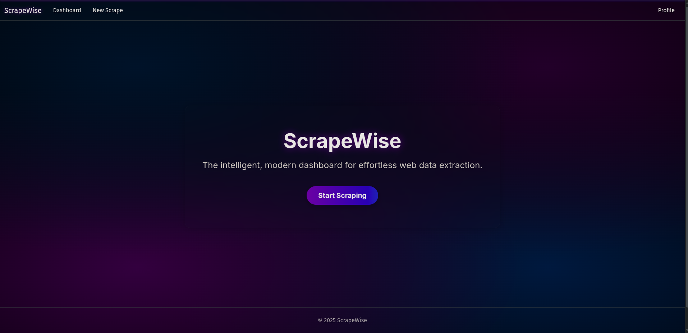
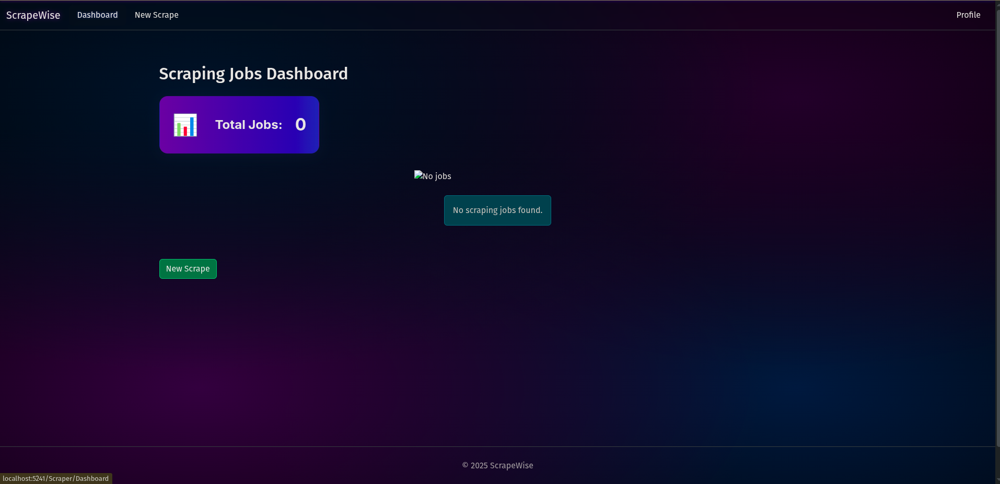
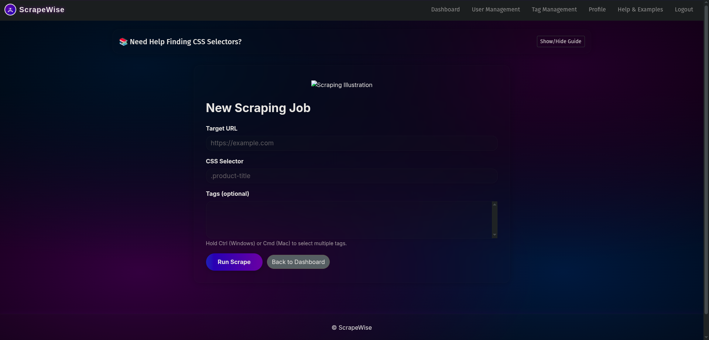
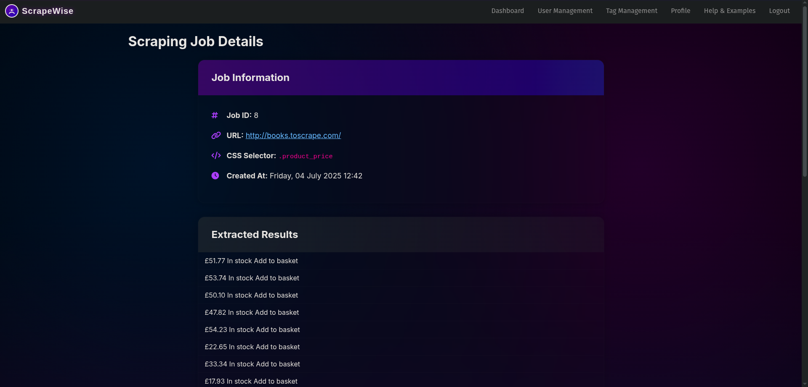
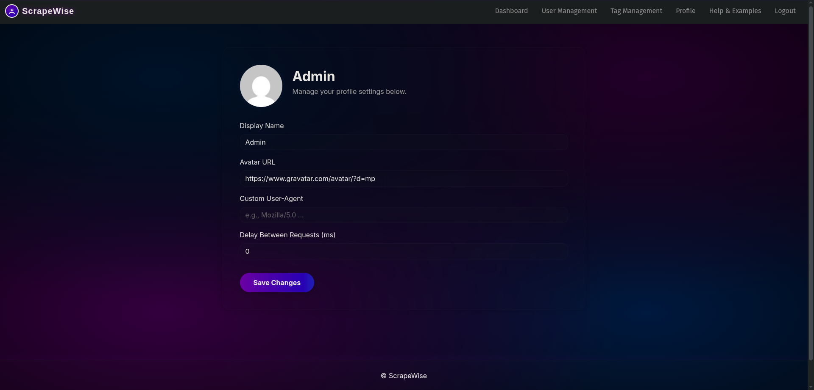

# ScrapeWise - Intelligent Web Scraping Dashboard



ScrapeWise is a modern, user-friendly web dashboard built with ASP.NET Core MVC that transforms complex web scraping into a simple, accessible process. It features a dynamic "Aurora Glass" theme and demonstrates key data relationship concepts, including one-to-one (User to Profile) and one-to-many (User to Jobs, Job to Results).

**🎯 Perfect for:** Data analysts, researchers, business owners, students, and anyone who needs to extract information from websites without technical knowledge.

---

## ✨ Features

### **🎨 Modern & User-Friendly Interface**
- **Aurora Glass Theme:** Beautiful, dynamic UI with glassmorphism effects
- **Responsive Design:** Works perfectly on desktop, tablet, and mobile devices
- **Intuitive Navigation:** Clean, professional interface that's easy to use

### **📊 Complete Job Management**
- **Easy Job Creation:** Create scraping jobs with just a URL and CSS selector
- **Visual Help System:** Built-in step-by-step guide for finding CSS selectors
- **Quick Examples:** Ready-to-use templates for popular websites
- **Dashboard Overview:** View all jobs in an organized, searchable table
- **Detailed Results:** Dive deep into each job's parameters and extracted data
- **Safe Deletion:** Remove jobs with confirmation modals

### **👤 User Profile System**
- **Personalized Experience:** Customize your display name and avatar
- **Scraping Preferences:** Set custom user agents and request delays
- **One-to-One Relationship:** Demonstrates advanced database concepts

### **🔧 Technical Excellence**
- **Persistent Storage:** All data saved to database using Entity Framework Core
- **Error Handling:** Graceful error management with helpful messages
- **Security:** CSRF protection and input validation
- **Scalable Architecture:** Built for growth and future enhancements

---

## 🛠️ Technology Stack

- **Backend:** C#, ASP.NET Core MVC
- **Database:** Entity Framework Core, SQL Server
- **Frontend:** HTML, CSS, JavaScript, Bootstrap 5
- **Scraping Library:** HtmlAgilityPack
- **UI Framework:** Custom Aurora Glass theme with glassmorphism effects

---

## 🚀 Getting Started

### Prerequisites

- [.NET 9 SDK](https://dotnet.microsoft.com/download/dotnet/9.0)
- A code editor like [Visual Studio Code](https://code.visualstudio.com/) or [Visual Studio](https://visualstudio.microsoft.com/)
- SQL Server or another database supported by Entity Framework Core

### Installation & Setup

1. **Clone the repository:**
   ```sh
   git clone <your-repo-url>
   cd ScrapeWise-Intelligent-Web-Scraping-Dashboard-ASP.NET-Core-MVC-
   ```

2. **Configure the database connection:**
   - Open `appsettings.json`
   - Modify the `ConnectionString` to point to your local database instance
   - Example for SQL Server LocalDB:
     ```json
     "ConnectionStrings": {
       "DefaultConnection": "Server=(localdb)\\mssqllocaldb;Database=ScrapeWiseDB;Trusted_Connection=True;MultipleActiveResultSets=true"
     }
     ```

3. **Apply database migrations:**
   ```sh
   dotnet ef database update
   ```

4. **Run the application:**
   ```sh
   dotnet run
   ```

5. **Open your browser** and navigate to the provided local address (e.g., `https://localhost:5241`)

---

## 📖 How to Use ScrapeWise

### **For Beginners (No Technical Knowledge Required)**

1. **Start with Examples:** Use the built-in examples in the help section
   - Quotes: `http://quotes.toscrape.com/` with selector `.text`
   - Books: `http://books.toscrape.com/` with selector `.product_pod h3 a`
   - News: `https://news.ycombinator.com/` with selector `.titleline a`

2. **Follow the Visual Guide:** Click "Show/Hide Guide" on the New Scrape page for step-by-step instructions

3. **Create Your First Job:** Copy an example URL and selector, then click "Run Scrape"

### **For Advanced Users**

1. **Find Your Own Selectors:** Use browser developer tools to identify CSS selectors
2. **Customize Your Profile:** Set your display name and scraping preferences
3. **Manage Your Jobs:** View, analyze, and delete jobs as needed

---

## 🎯 Real-World Use Cases

- **E-commerce:** Monitor competitor prices across different stores
- **Research:** Collect data for academic studies and market analysis
- **Lead Generation:** Extract contact information from business directories
- **Content Aggregation:** Gather news headlines from multiple sources
- **Price Monitoring:** Track product prices for personal or business use
- **Data Analysis:** Collect data for business intelligence and reporting

---

## 📸 Screenshots

*Replace the placeholders below with screenshots of your application.*

| Dashboard | New Scrape |
| :---: | :---: |
|  |  |

| Job Details | Profile Page |
| :---: | :---: |
|  |  |

---

## 🔮 Future Enhancements

- **Visual Selector Tool:** Click-to-select elements on websites
- **Scheduled Scraping:** Automated jobs that run at specified intervals
- **Data Export:** Export results to CSV, JSON, or Excel formats
- **API Endpoints:** RESTful API for mobile app integration
- **Advanced Selectors:** Support for XPath and other selector types
- **User Authentication:** Secure login system with user accounts

---

## 🤝 Contributing

This project was developed as a school assignment demonstrating ASP.NET Core MVC, Entity Framework Core, and modern web development practices. It showcases:

- **Database Design:** Proper one-to-one and one-to-many relationships
- **Modern UI/UX:** Professional, accessible interface design
- **Full-Stack Development:** Complete CRUD operations with data persistence
- **User Experience:** Built-in help systems and examples for accessibility

---

## 📄 License

This project is created for educational purposes as part of a web development course assignment.
